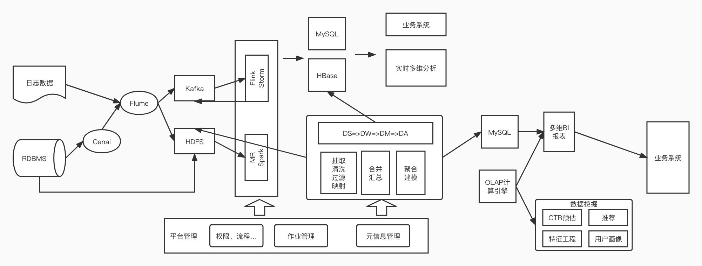

### 题目一

**执行结果：该 SQL 用到了如下优化规则**

org.apache.spark.sql.catalyst.optimizer.ColumnPruning

org.apache.spark.sql.catalyst.optimizer.ReplaceIntersectWithSemiJoin

org.apache.spark.sql.catalyst.optimizer.ReplaceDistinctWithAggregate

org.apache.spark.sql.catalyst.optimizer.ReorderJoin

org.apache.spark.sql.catalyst.optimizer.PushDownPredicates

org.apache.spark.sql.catalyst.optimizer.PushDownLeftSemiAntiJoin

org.apache.spark.sql.catalyst.optimizer.CollapseProject

org.apache.spark.sql.catalyst.optimizer.EliminateLimits

org.apache.spark.sql.catalyst.optimizer.ConstantFolding

org.apache.spark.sql.catalyst.optimizer.RemoveNoopOperators

org.apache.spark.sql.catalyst.optimizer.InferFiltersFromConstraints

org.apache.spark.sql.catalyst.optimizer.RewritePredicateSubquery

**(3) 选择 PushDownPredicates 和 ReorderJoin 这两条规则**

- PushDownPredicates 

  - `PushDownPredicate`  is a base logical optimization that removes (eliminates) View logical operators from a logical query plan.
  - 谓词下推， 顾名思义，就是把过滤算子（就是你在 sql语句里面写的 where语句），尽可能地放在执行计划靠前的地方，好处就是尽早地过滤到不必要的数据，后续流程都节省了计算量，从而优化了性能。

- ReorderJoin 

   - `ReorderJoin` is a logical optimization for join reordering.

     `ReorderJoin` applies the join optimizations on a logical plan with 2 or more inner and cross joins with at least one join condition.

  	- 这个规则是对 Join 操作进行重新排列，有两种做法。一种是逻辑上的转换，即将在 where 中涉及到两个表关联或者 filter 的条件提前至相应的 join 操作中，减少参与 join 的数据量以及最终 join 结果的数据量。还有一种做法是基于成本的做法，通过启用成本优化器，以及对 join 的表进行统计，spark 会根据 join 的成本选择代价最小的 join 方式

### 题目二

- 架构图

  

在 lambda 架构中，通过双线计算，用离线补充实时数据，完成整体数据输出+展示。

**lambda 架构优点：**

1. 职责边界清晰。离线和实时各自计算各自范围内的数据；
2. 容错性。离线数据可以补充实时计算历史统计的数据；
3. 复杂性隔离。离线数据，可以很好的掌控。采用增量算法处理实时数据，复杂性比离线要高很多。通过分开离线和实时计算，把复杂性隔离到实时计算，可以很好的提高整个系统的鲁棒性和可靠性。

**lambda 架构缺点：**

针对 lambda 模式来说，存在以下几个问题点：

1. 同样需求两套代码
2. 集群资源使用增多，因为离线任务+实时任务
3. 离线结果和实时结果不一致问题
4. 批量计算 T+1，当数据量大的时候，可能晚上计算不完
5. 存储成本增大

### 毕业总结

​		参加本次大数据训练营，简单看完了所有课程，每一节课程简短，适合碎片化学习。还配合实战课程来给我们锻炼，不过由于大数据搭建环境复杂，自己本地模拟的时候，还是遇到很多奇怪的报错，幸好有老师配合排查。只要花时间学习和实践，总的来说还是基本能满足入门大数据的。

​	    路漫漫其修远兮，我将上下而求索。继续加油~